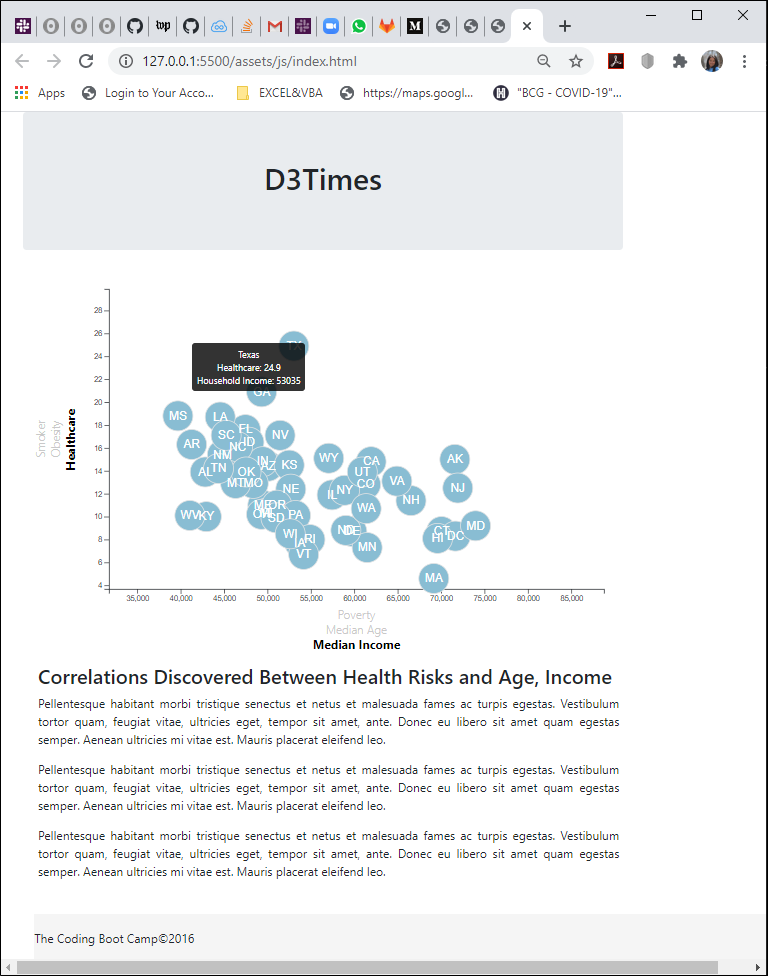

# Data-Journalism  
 

# Unit - 16 Data Journalism And D3
Exploration in d3, data mining, and graph creation 

In this assignment we created an interactive graph for a story that features  the health risks facing particular demographics, using information from the U.S. Census Bureau and the Behavioral Risk Factor Surveillance System. 
 
The data for each states includes : 
- Percentage of people having healthcare
- Percentage of smokers
- Percentage of obese person
- Percentage of people in poverty
- Median age
- Median household income

The data set is based on 2014 ACS 1-year estimates: [https://factfinder.census.gov/faces/nav/jsf/pages/searchresults.xhtml](https://factfinder.census.gov/faces/nav/jsf/pages/searchresults.xhtml)

# Interactive D3 Graph

Using the D3 techniques, we decided to create a scatter plot between two sets of the data variables (healthcare, obesity, and smoker, and poverty, median age and medium income, which gave the users ability to choose which data set that they wanted to see. The graph has `Healthcare vs. Poverty` as its initial variables, with each state represented by circle elements. 
The graph includes 
- state abbreviations in the circles as identifiers.
- xaxis and y axis whose values change as the choice changed
- d3-tip, which reveals the value of data that the user has selected when he/she hovers their cursor over the element.

Please try to play with our graph.

### Copyright

Trilogy Education Services © 2019. All Rights Reserved.
